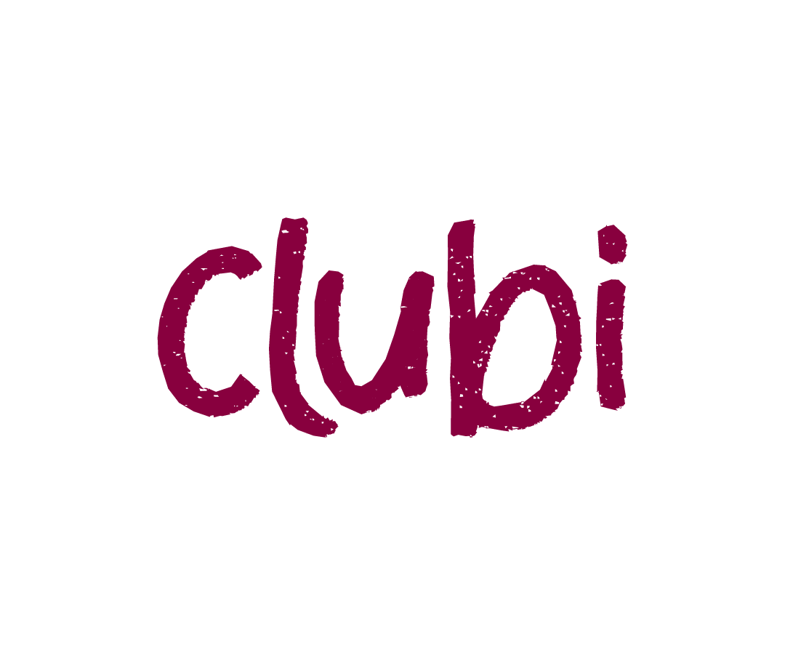
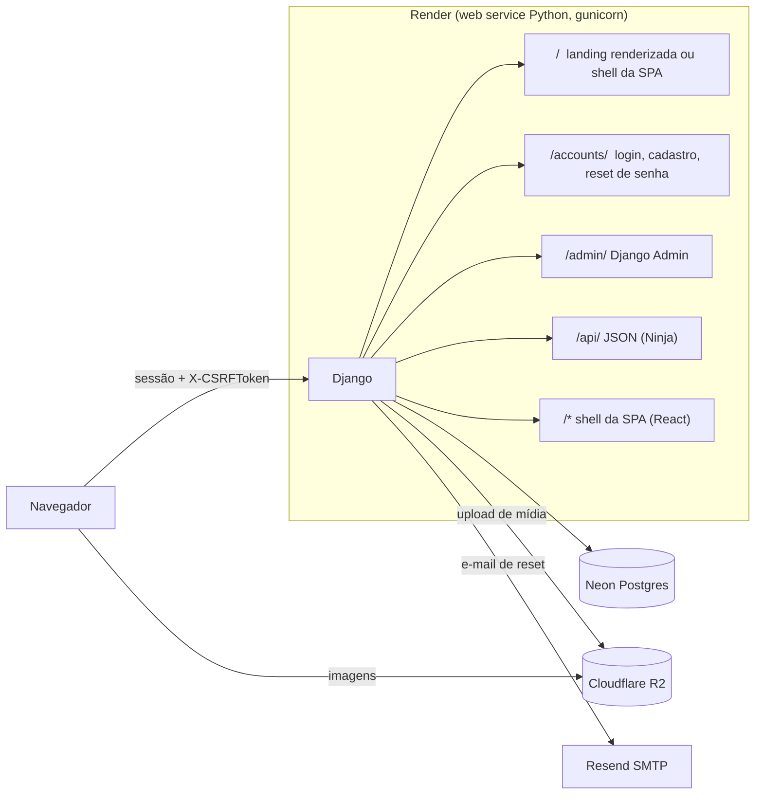

<p align="center">
  <picture>
    <source media="(prefers-color-scheme: dark)" srcset="frontend/clubi/logo/logo-transp-clara-clubi.png">
    
  </picture>
</p>

<p align="center">
  Site do Clubi, o clube de leitura na ESPM: livro do mês, progresso de leitura, resenha,
  estante de favoritos e postagens com imagens.
</p>

<p align="center">
  <strong><a href="https://leiaclubi.com.br">leiaclubi.com.br</a></strong>
</p>

<p align="center">
  
  
  
  
  
  
</p>

<!--
Screenshots: ainda não capturadas. Caminhos sugeridos:
  docs/screenshots/landing.png  — página de apresentação, janela anônima
  docs/screenshots/home.png     — Home com o livro do mês, logado
  docs/screenshots/perfil.png   — perfil com estante e histórico
-->

## Funcionalidades

Para o membro do clube:

- Ver o livro do mês na página inicial, com capa, autor e o texto do clube sobre a escolha.
- Marcar o progresso da leitura e, depois de marcar o livro como terminado, dar nota (com meia estrela) e escrever a resenha — as duas opcionais e editáveis a qualquer momento.
- Ver quem já terminou a leitura do mês, com a nota e a resenha de cada um, e percorrer as escolhas anteriores.
- Ler as postagens do clube, com imagens, e saber quantas chegaram desde a última visita.
- Montar a estante: quatro livros favoritos, buscados no acervo do clube ou na Open Library.
- Ter um perfil com foto, uma frase e o histórico de todas as leituras; procurar outros membros pelo nome.
- Conta completa: cadastro, login, logout e recuperação de senha por e-mail.

Para quem organiza o clube:

- Cadastrar livros e definir a escolha de cada mês.
- Publicar, editar e despublicar postagens com até quatro imagens.
- Gerenciar membros e permissões. Ler é de todo membro; escrever é da organização, e a API devolve 403 para quem não é staff.

Toda a API exige login (ADR-19). A única página aberta a visitantes é a apresentação em `/`.

## Stack

| Camada | Tecnologia | Por quê |
|---|---|---|
| Backend | Django 6.0 | ORM, autenticação, sessão e Admin prontos no primeiro dia |
| API | Django Ninja 1.6 | endpoints tipados com Pydantic, docs OpenAPI em `/api/docs` sob `DEBUG` ou para staff |
| Frontend | React 19 + TypeScript 5.9 + Vite 8 | SPA servida pelo próprio Django, sem segunda origem |
| Estado de servidor | TanStack Query 5 | cache e revalidação das chamadas à API sem estado manual |
| Contrato | openapi-typescript 7 | tipos do frontend gerados do schema do Ninja, nunca escritos à mão |
| Banco | PostgreSQL (psycopg 3) | SQLite em desenvolvimento, Postgres em produção |
| Mídia | django-storages + Cloudflare R2 | disco de host é efêmero; upload vai para object storage |
| Erros | Sentry | monitoramento nas duas pontas, só quando há DSN, e sem dado do membro no evento |
| Testes | pytest + pytest-django, vitest | 279 testes: 252 no backend, por app, e 27 no frontend, na lógica pura |

## Arquitetura



## Deploy e infraestrutura

| Serviço | Papel |
|---|---|
| [Render](https://render.com) | PaaS. Web service Python rodando gunicorn, região Virginia |
| [Neon](https://neon.tech) | Postgres serverless com scale to zero, na mesma região do Render |
| [Cloudflare R2](https://www.cloudflare.com/developer-platform/r2/) | object storage de toda a mídia, servido por domínio próprio via django-storages |
| [Resend](https://resend.com) | SMTP transacional do reset de senha, com domínio verificado |
| [Sentry](https://sentry.io) | monitoramento de erros do Django e do navegador, dois projetos no plano gratuito |

O banco que escala a zero muda o que um deploy comum faz sem pensar. O health check em `/healthz` não toca o banco, com um teste que exige zero queries, para que o compute do Neon consiga suspender apesar das sondas do Render. As conexões usam `conn_max_age=0`, porque um socket guardado pelo gunicorn morre do outro lado quando o Neon suspende e viraria um 500 no primeiro acesso após cada período ocioso. A consulta do livro do mês na landing é cacheada por 15 minutos, para que crawlers e monitores não mantenham o banco acordado. O build vive em [`render-build.sh`](render-build.sh), versionado junto com o código, e o `settings.py` levanta `ImproperlyConfigured` quando falta `DATABASE_URL`, `R2_BUCKET` ou o build do frontend fora de `DEBUG`, para que um deploy mal configurado falhe no build em vez de subir quebrado. O SDK da Sentry só inicia quando existe `SENTRY_DSN`, então máquina de desenvolvimento e `pytest` nunca alcançam a rede, e os source maps são apagados depois do upload — o Django serve o `dist/` sob `/static/`, e um `.map` sobrevivente publica o código-fonte da SPA.

## Decisões de arquitetura

Decisões que definem o projeto, cada uma com o registro completo em [`clubi-decisoes-de-arquitetura.md`](clubi-decisoes-de-arquitetura.md):

- **Mono-repo e mesma origem.** A SPA é servida pelo Django e fala com `/api/` usando o cookie de sessão e o header `X-CSRFToken`. Não há CORS nem JWT: essa classe de problemas só existe quando as origens se separam. ([ADR-03](clubi-decisoes-de-arquitetura.md#adr-03--spa-separada-mesmo-repositório), [ADR-04](clubi-decisoes-de-arquitetura.md#adr-04--mesma-origem-autenticação-por-sessão))
- **Autenticação em views renderizadas.** Login, cadastro, logout e reset de senha ficam sob `/accounts/`, com o fluxo de reset do próprio Django: token assinado, expiração e envio de e-mail. A API não tem endpoint de login; o sinal para a SPA é `GET /api/me` responder 401. ([ADR-05](clubi-decisoes-de-arquitetura.md#adr-05--autenticação-em-views-renderizadas))
- **Histórico preservado no modelo.** `MonthlyPick` é a escolha de um mês e `MonthlyReading` é a leitura de um membro daquela escolha. Não existe booleano "livro do mês", porque ele apagaria o histórico a cada troca. ([ADR-06](clubi-decisoes-de-arquitetura.md#adr-06--livro-do-mês-como-entidade-própria), [ADR-07](clubi-decisoes-de-arquitetura.md#adr-07--monthlyreading-unifica-progresso-e-histórico))
- **Contrato tipado ponta a ponta.** `frontend/src/api/generated.ts` é gerado do schema OpenAPI por `make types`, e `tsc --noEmit` roda em `make check`. Renomear um campo no backend quebra o build em vez de virar `undefined` em produção. ([ADR-12](clubi-decisoes-de-arquitetura.md#adr-12--tipos-do-frontend-gerados-do-openapi))
- **Apps autocontidos.** Cada app Django é dono dos seus modelos, schemas e rotas. O app `api/` só monta a instância do Ninja e guarda as duas projeções compartilhadas, porque formato de resposta pertence à rota, não à entidade que ele cita. ([ADR-15](clubi-decisoes-de-arquitetura.md#adr-15--apps-autocontidos-não-um-app-de-api-central))
- **Brandbook como fonte da verdade visual.** A identidade do clube é anterior ao site, e [`frontend/DESIGN.md`](frontend/DESIGN.md) é a destilação normativa dela para a web — leitura obrigatória antes de qualquer trabalho de frontend. Os tokens vivem em dois arquivos gêmeos, `backend/core/static/css/tokens.css` e `frontend/src/styles/tokens.css`, que mudam juntos ou reabrem a costura entre `/accounts/` e a SPA. ([ADR-17](clubi-decisoes-de-arquitetura.md#adr-17--brandbook-como-fonte-da-verdade-visual))
- **Landing renderizada em `/`.** Visitante anônimo recebe HTML puro com `og:title`, `og:description` e `og:image` do livro do mês; membro logado recebe a SPA na mesma URL. Crawler de WhatsApp e Instagram não executa JavaScript, e o preview do link é a função da página. ([ADR-18](clubi-decisoes-de-arquitetura.md#adr-18--página-de-apresentação-renderizada-em-))
- **API fechada por padrão.** `auth=django_auth` é global e as exceções públicas vivem numa lista nomeada e testada, que nasce vazia. Um teste varre as rotas registradas e exige 401 de cada uma, e o `/api/docs` acompanha: fora de `DEBUG`, responde 404 a quem não é staff. ([ADR-19](clubi-decisoes-de-arquitetura.md#adr-19--api-fechada-por-padrão))
- **Ler é do clube, escrever é da organização.** Todo membro lê o feed; criar, editar, apagar postagem e anexar imagem são `is_staff`, recusados com 403 em pt-BR. O que é do membro — progresso, nota, resenha, estante, perfil — as rotas alcançam por `request.user`, nunca por um id vindo do cliente. ([ADR-21](clubi-decisoes-de-arquitetura.md#adr-21--ler-é-do-clube-escrever-é-da-organização))
- **Monitoramento que não exfiltra.** O Sentry entra só com erros, e o payload foi restringido antes de o DSN existir: sem PII, sem variáveis locais, sem corpo de requisição, sem tracing. O que o membro escreveu não sai da aplicação. ([ADR-20](clubi-decisoes-de-arquitetura.md#adr-20--sentry-para-erros-com-o-payload-decidido-antes-do-dsn))

Uma honestidade que o documento registra com esse nome: a SPA foi escolhida por objetivo declarado de aprendizado e portfólio, não por necessidade técnica. Templates renderizados bastariam para o clube. O ADR-03a diz isso por extenso e é a única decisão do projeto tomada por critério não técnico. Dada essa escolha, o mono-repo e a mesma origem são o caminho mais simples, não uma concessão.

O arquivo completo tem 21 decisões, cada uma com contexto, alternativas descartadas, consequências assumidas e o critério para revisá-la.

## Rodando localmente

Pré-requisitos: Python 3.12, Node 20.19 ou 22.12 em diante (exigência do Vite 8) e [uv](https://docs.astral.sh/uv/).

```bash
git clone https://github.com/nossar/Clubi.git && cd Clubi
cp backend/.env.example backend/.env
make install                                   # uv sync no backend, npm ci no frontend
make migrate
cd backend && uv run manage.py createsuperuser
```

Em desenvolvimento os valores do `.env.example` bastam: o banco é SQLite, os uploads vão para `backend/media/` e os e-mails de reset saem no console. Não é preciso Neon, R2 nem Resend.

Depois, dois processos em dois terminais:

```bash
make dev-backend    # Django em :8000
make dev-frontend   # Vite em :5173
```

Abra `localhost:5173`. O Vite faz proxy de `/api`, `/admin`, `/accounts`, `/media` e `/static` para o Django em `:8000`, preservando a origem única. A landing é a exceção: como `/` é a raiz da SPA no Vite, ela só aparece em `localhost:8000`, numa janela anônima.

Testes, tipos e demais alvos:

```bash
make check    # manage.py check + pytest; depois tsc --noEmit, vitest e o build da SPA
make types    # regenera frontend/src/api/generated.ts a partir do schema OpenAPI
make lint     # ruff check e ruff format no backend
make build    # build da SPA e collectstatic
```

No Windows com Make do MSYS2, o binário se chama `mingw32-make`.

## Estrutura do repositório

```
.
├── backend/                 # projeto Django
│   ├── api/                 # instância do Ninja, projeções compartilhadas e o teste de política 401
│   ├── books/               # Book, MonthlyPick, MonthlyReading, Favorite
│   ├── posts/               # postagens e imagens
│   ├── users/               # User customizado, cadastro, perfil
│   ├── core/                # landing, healthz, shell da SPA e os estáticos compartilhados
│   ├── clubi/               # settings e urls
│   └── templates/           # landing.html, index.html e as páginas de /accounts/
├── frontend/                # SPA
│   ├── src/                 # rotas, componentes, cliente da API e tipos gerados
│   ├── clubi/               # identidade visual: brandbook, logos, elementos, tipografia
│   └── DESIGN.md            # fonte da verdade visual
├── .claude/                 # CLAUDE.md do projeto e as skills copiadas
├── .mcp.json                # servidores MCP
├── clubi-decisoes-de-arquitetura.md
├── render-build.sh          # build de produção no Render
├── skills-lock.json         # origem e hash de cada skill copiada
└── Makefile
```

## Documentação

- [`clubi-decisoes-de-arquitetura.md`](clubi-decisoes-de-arquitetura.md): os 21 ADRs, com contexto, alternativas descartadas, consequências e critério de revisão.
- [`frontend/DESIGN.md`](frontend/DESIGN.md): tokens, regras de logo e elementos, tom da interface e o registro numerado do que a web exigiu além do brandbook. É leitura obrigatória antes de qualquer trabalho de frontend (ADR-17).

## Fluxo de desenvolvimento

O projeto é desenvolvido com apoio do Claude Code. O que isso deixa versionado, e que um novo contribuidor vai encontrar ([ADR-16](clubi-decisoes-de-arquitetura.md#adr-16--ferramental-de-desenvolvimento-do-frontend)):

- **Três arquivos `CLAUDE.md`**: `.claude/CLAUDE.md` traz as regras que valem no projeto inteiro; `backend/CLAUDE.md` e `frontend/CLAUDE.md`, só o que é específico de cada pasta.
- **`.mcp.json`**, com o Chrome DevTools MCP e o MCP da Sentry. O primeiro tem duas regras de uso: apontar o navegador para o Vite em `:5173`, não para o Django em `:8000`, e usar só contra o ambiente local.
- **`.claude/skills/`**, com `frontend-design` e `doc-coauthoring` copiadas do repositório oficial e fixadas por hash em `skills-lock.json`. A `frontend-design` foi usada uma vez, para produzir o primeiro `tokens.css`, e não volta ao fluxo.

## Créditos

A identidade visual é do clube e antecede o site: brandbook, logotipos, elementos gráficos e peças de redes sociais estão em `frontend/clubi/`. As fontes são Clash Display, sob a licença em `frontend/clubi/tipografia/clash-display-font/`, e Manrope, sob SIL Open Font License; as duas são servidas pelo próprio site, em `woff2`.
